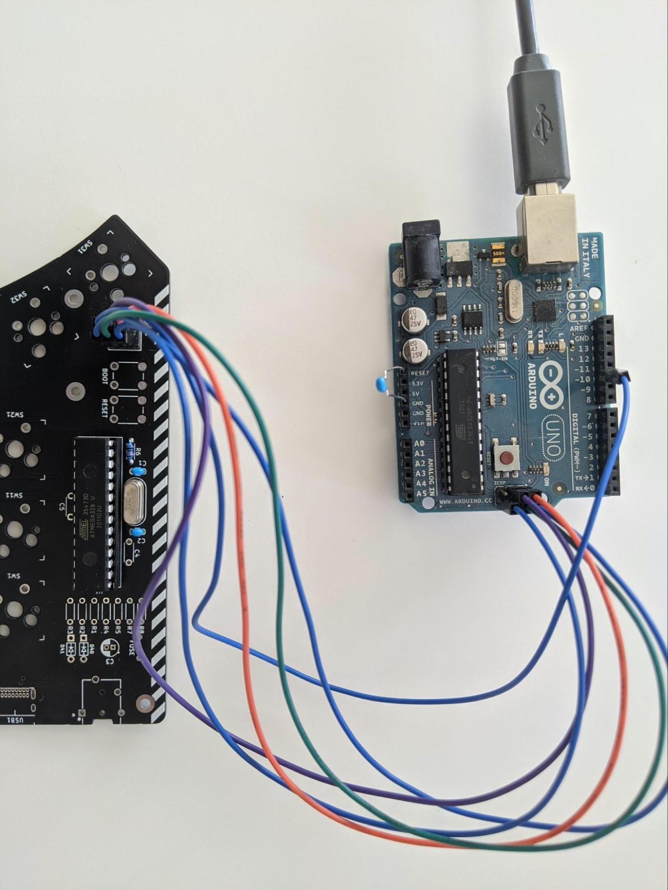

# Flashing the bootloader

If you bought the Torn Keyboard kit the ATmega328P has already been programmed, otherwise if you purchased your own components you need to follow this section of the guide.

This guide uses an Arduino Uno to program the keyboard. You can use other ISP programmers that are supported by avrdude.


#### Arduino Uno as ISP

First you need to program the Arduino Uno as an ISP, as described in Load the Sketch at [https://www.arduino.cc/en/Tutorial/ArduinoISP#toc5](https://www.arduino.cc/en/Tutorial/ArduinoISP#toc5).


#### Wiring the programmer

You can use an Arduino Uno to program the AMegta328P with the ISP header on the right PCB. You need to connect the following pins:


Arduino Uno | Torn Keyboard
----------- | -------------
ICSP Pin 1 - MISO | ICP Pin 1 - COL4
ICSP Pin 2 - +Vcc | ICP Pin 2 - +5V
ICSP Pin 3 - SCK | ICP Pin 3 - COL3
ICSP Pin 4 - MOSI | ICP Pin 4 - COL5
ICSP Pin 5 - Reset | -
ICSP Pin 6 - Gnd | ICP Pin 6 - GND
Digital Pin 10 | ICP Pin 5 - Reset

The Arduino Uno board needs a 10µF electrolytic capacitor connected to RESET and GND with the positive (long leg) connected to RESET. The capacitor has to be placed after the programmer board has been loaded with the ISP sketch.




#### Flash the bootloader

Download the USBaspLoader source code from [https://github.com/rtitmuss/USBaspLoader/tree/torn](https://github.com/rtitmuss/USBaspLoader/tree/torn). You may need to modify the `PROGRAMMER` setting in `Makefile.inc` if you are using a different ISP programmer or OS.

You can then flash the bootloader using:

```
    make
    make flash
    make fuse
```

One the bootloader has been flashed to the board, disconnect the Arduino Uno.
