# Torn Keyboard Build

Welcome to the Torn keyboard build instructions.

## You Need

You need the following components (not included in the Torn Keyboard kit).

Cherry MX compatible build:

*   USB C cable
*   TRRS cable
*   42-44 x MX Cherry MX compatible switches \
42-44 x Kailh PCB Socket N:CPG151101S11 **(optional)**
*   Keycaps for MX switches
*   2 x EC11 Encoders and knobs **(optional)**

Kailh low profile (choc) build:

*   USB C cable
*   TRRS cable
*   42-44 x Kailh low profile switch PG1350
*   Keycaps for Kailh low profile switches
*   2 x EC11 Encoders and knobs **(optional)**

Note: the cable must be a **TRRS cable** with 4 contacts and NOT a TRS cable with 3 contacts.

The following tools are required to build the Torn Keyboard kit:

*   Soldering iron and solder wire (leaded solder recommended)
*   Flush side cutters
*   No-clean flux paste (recommended to prevent bridging on USB pins)
*   Desoldering wick and Solder sucker (recommended to fix any mistakes) 
*   Phillips head screwdriver 


## What’s included

The following components are included in the Torn Keyboard kit:


Ref | Component | Notes
--- | --------- | -----
C1, C2 | ***2 x 22pF Capacitor***
C3 | ***1 x 4.7uF Capacitor***
C4, C5, C6 | ***3 x 0.1uF Capacitor***
D1-44 | ***44 x 1n4148 Diode***
D50, D51 | ***2 x 3.6V Zener Diode*** | Keep separate from the 1n4148 diodes!
F1 | ***1 x 500ms Resettable fuse*** | 
ISP1 | **1 x 6 pin header***
J1, J2 | ***2 x TRRS socket***
L1, L2, L3 | ***3 x LED***
OLED1 | ***1 x OLED display***
R1 | ***1 x 1.5k Tan Resistor*** | ***Brown - Green - Red***
R2, R3 | ***2 x 75 Tan Resistor*** | ***Purple - Green - Orange***
R6 | ***1 x  10k Blue Resistor*** | ***Brown - Black - Orange***
R4, R5 | ***2 x 5.1k Blue Resistor*** | ***Green - Brown - Red***
R7, R8 | ***2 x 2.2k Blue Resistor*** | ***Red - Red - Red***
R50-52 | ***3 x 5.1K Tan Resistor*** | ***Green - Brown - Red***
. | ***2 x 28 pin IC socket***
BOOT, RESET | ***2 x 6mm Push button***
U1 | ***1 x ATmega328P***
U2 | ***1 x I/O Expander***
USB1 | ***1 x USB4085 SB C port***
Y1 | ***1 x 16MHz Crystal***
. | ***10 x 3mm spacer***
. | ***6 x 8mm spacer***
. | ***16 x 3+3mm spacer***
. | ***6 x 5mm screw***
. | ***26 x 3mm screw***
. | ***8 x Feet***


## Build Guide

Let’s start building, all the parts ready:


### Left side

**Step 1**

**22 x 1n4148 Diodes (D1 - D22)**

THIS PART HAS A SPECIFIC ORIENTATION - the **black bar on the diode will point LEFT** and will line up with the square pad.

Bend the legs straight down as close to the diode as possible, insert, solder and clip the legs.


**Step 2**

**2 x 5.1k Blue resistors (R4, R5)**

Bend the leds straight down as close to the resistor as possible, insert, solder and clip the legs.


**Step 3**

**2 x 2.2k Blue resistors (R7, R8)**

Bend the leds straight down as close to the resistor as possible, insert, solder and clip the legs.


**Step 4**

**1 x 10k Blue resistor (R6)**

Bend the leds straight down as close to the resistor as possible, insert, solder and clip the legs.


**Step 5**

**5 x 75 Tan resistor (R2, R3)**

Bend the leds straight down as close to the resistor as possible, insert, solder and clip the legs.


**Step 6**

**1 x 1.5k Tan resistor (R1)**

Bend the leds straight down as close to the resistor as possible, insert, solder and clip the legs.

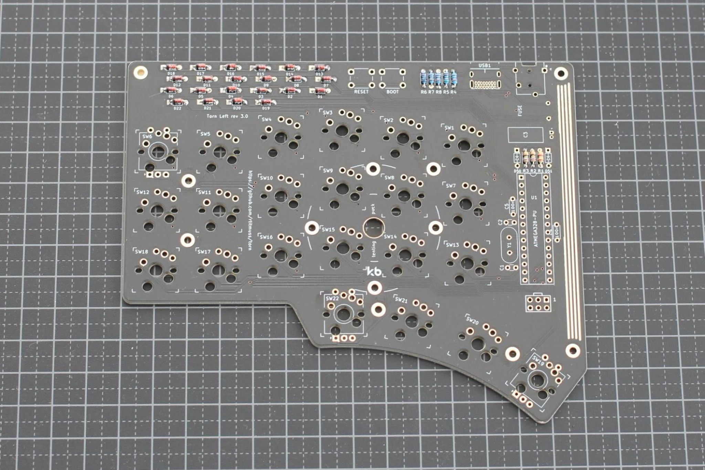


**Step 7**

**2 x 3.6V Zener Diode (D40, D41)**

THIS PART HAS A SPECIFIC ORIENTATION - the **black bar on the diode will point UP** and will line up with the square pad.

Bend the legs straight down as close to the diode as possible, insert, solder and clip the legs.


**Step 8**

**1 x 16MHz Crystal (Y1)**

Insert the crystal, solder and clip the legs.


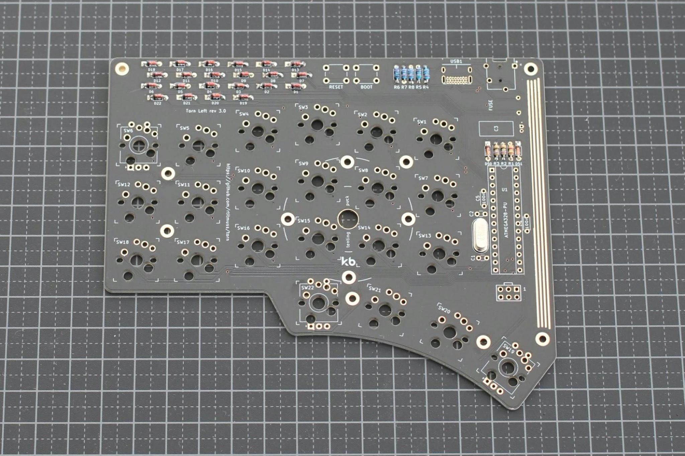


**Step 9**

**2 x 22pF Capacitor (C1, C2)**

These capacitors are the smaller blue capacitors with straight legs.

Insert the capacitors, solder and clip the legs.


**Step 10**

**2 x 0.1uF Capacitor (C4, C5)**

These capacitors are the larger blue capacitors with wider legs.

Insert the capacitors, solder and clip the legs.


**Step 11**

**1 x USB4085 USB C port (USB1)**

Insert and tape the USB C port to the board. Flip board over. Solder only one of the large bottom legs. Check the port is flush before soldering the other three legs.  Remove the tape.

For the small pins you are going to use a different technique than the rest of the components. Apply no-clean flux paste across all pins. This step is possible without flux, but using it is highly recommended and will make the process much easier. Proceeding without flux for this step is not recommended. Apply a small amount of solder and drag your iron across the pins. Repeat until all holes are filled as pictured above.


**Step 12**

**1 x TRRS socket (J2)**

Tape the TRRS socket to the board. Flip the board over. Solder only one pin, and check to ensure it is flush before continuing. After checking solder the remaining pins. Remove the tape.


**Step 13**

**1 x 28 pin IC socket**

THIS PART HAS A SPECIFIC ORIENTATION - the **notch** on the IC sockets must be pointing **UP**.

Tape the IC socket to the board. Solder two opposite corners of the IC socket. Check the socket is flush before continuing. Solder the rest of the pins. Remove the tape.


**Step 14**

**2 x 6mm Push button (BOOT, RESET)**

Insert and solder BOOT and RESET switches.


**Step 15**

**1 x 4.7uF Capacitor (C3)**

THIS PART HAS A SPECIFIC ORIENTATION - the **longer leg** goes to the **square pad**, which is **UP**.

Insert the capacitor and solder. Fold down the capacitor as pictured after soldering. Clip the legs.


**Step 16**

**1 x 500ms Resettable fuse (F1)**

Insert the fuse, and solder. Fold down the fuse as pictured after soldering. Clip the legs.

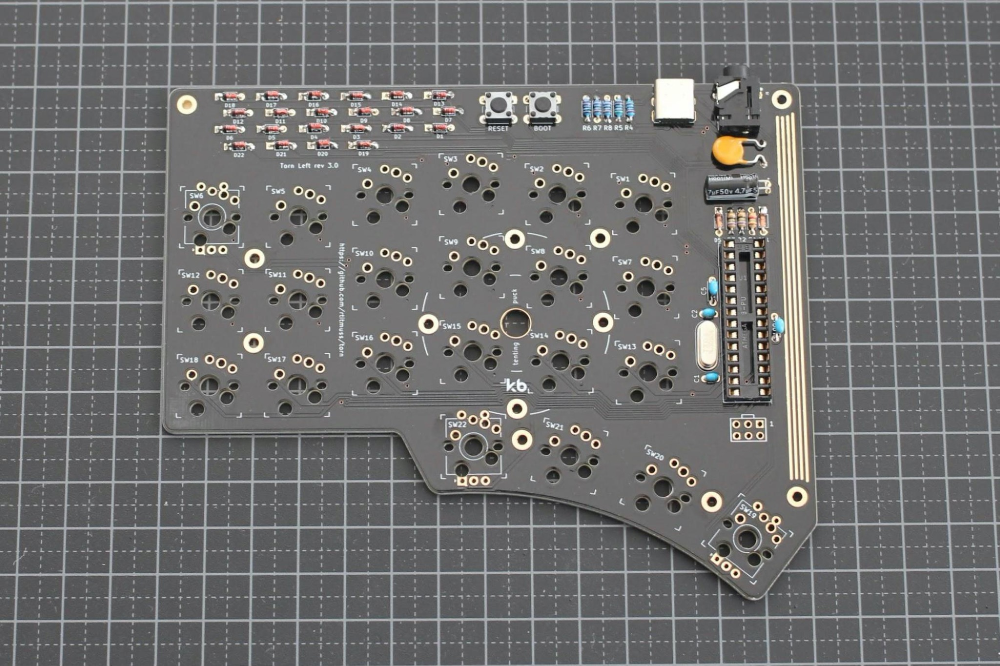


**Step 17**

**1 x ATmega328P (U1)**

THIS PART HAS A SPECIFIC ORIENTATION - The **notch** on the ATmega328P must be pointing **UP**.

CHECK YOU HAVE THE RIGHT PART - it looks similar to U2, check the writing says **ATMEGA328P**.

Insert the ATmega328P. You may have to GENTLY bend the pins slightly inward for proper alignment with the socket.


### Right side

**Step 18**

**22 x 1n4148 Diodes (D23 - D44)**

THIS PART HAS A SPECIFIC ORIENTATION - the **black bar on the diode will point LEFT** and will line up with the square pad.

Bend the legs straight down as close to the diode as possible, insert, solder and clip the legs.


**Step 19**

**3 x 75 Tan resistor  (R50-52)**

Bend the leds straight down as close to the resistor as possible, insert, solder and clip the legs.

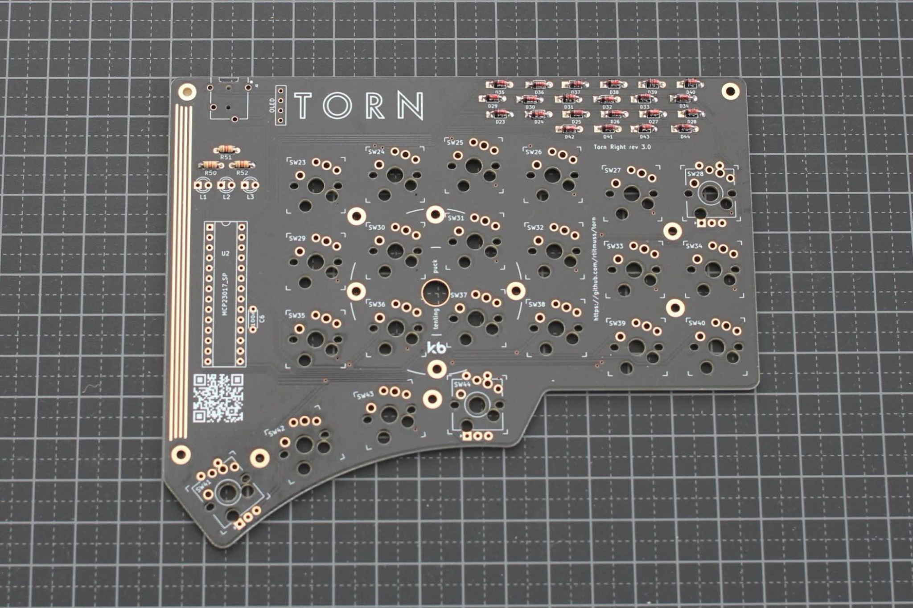


**Step 20**

**1 x 0.1uF Capacitor (C6)**

These capacitors are the larger blue capacitors with wider legs.

Insert the capacitors, solder and clip the legs.

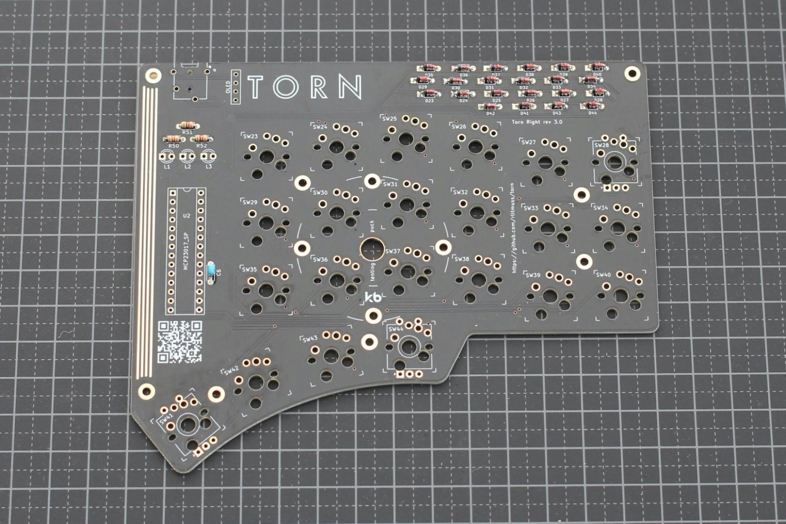


**Step 21**

**1 x TRRS socket (J3)**

Tape the TRRS socket to the board. Flip the board over. Solder only one pin, and check to ensure it is flush before continuing. After checking solder the remaining pins. Remove the tape.


**Step 22**

**1 x 28 pin IC socket**

THIS PART HAS A SPECIFIC ORIENTATION - the **notch** on the IC sockets must be pointing **UP**.

Tape the IC socket to the board. Solder two opposite corners of the IC socket. Check the socket is flush before continuing. Solder the rest of the pins. Remove the tape.


**Step 23**

**3 x LED (L1, L2, L3)**

THIS PART HAS A SPECIFIC ORIENTATION - the **shorter leg** goes to the **square pad**, which is **LEFT**.

Insert the LEDs, solder and clip the legs.


**Step 24 (Optional)**

**1 x OLED display**

You can optionally add an OLED display.

THIS PART HAS A SPECIFIC ORIENTATION - the **pins** go on the **LEFT**.

Insert the Oled, solder and clip the legs.


**Step 25**

**1 x I/O Expander (U2)**

THIS PART HAS A SPECIFIC ORIENTATION - The **notch** on the MCP23017 must be pointing **UP**

CHECK YOU HAVE THE RIGHT PART - it looks similar to U2, check the writing says **MCP23017**.

Insert the I/O Expander. You may have to GENTLY bend the pins slightly inward for proper alignment with the socket.


### Let’s test 

The firmware is preinstalled if you’ve bought a kit, otherwise before continuing see the instructions to flash the bootloader and qmk.

It is a good idea to now test the board before adding the key switches. This is easiest with Via, so first download and install it from [https://caniusevia.com/](https://caniusevia.com/). Your new Torn keyboard should be automatically detected when you connect it to your PC.

Select the Key Tester tab, and enable Test Matrix. You can now test each key switch by shorting the contacts with tweezers or some wire. Make sure all switches work before continuing.


### MX Switches with Kailh sockets

The following instructions are for MX Switches with Kailh sockets. You need to do all steps on both the left and right boards.

**Step 1**

**42-44 x Kailh Sockets**

Solder the Kailh Sockets on the reverse of the board. Do not add a socket where you will be using the optional EC11 encoders (for example sw22 in the diagram below).


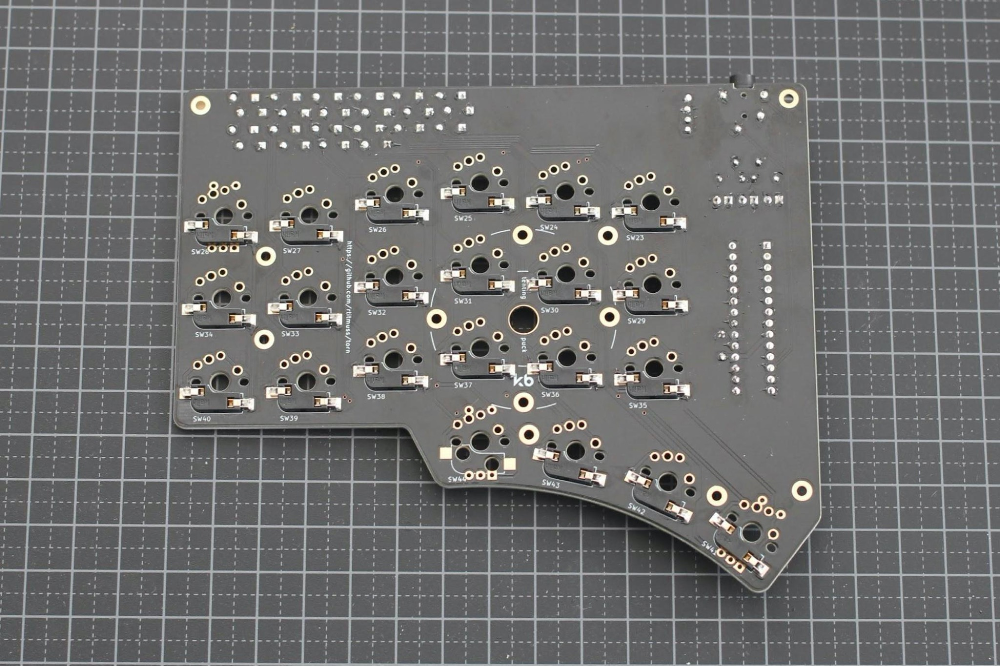


**Step 2**

**2 x EC11 encoder (optional)**

You can optionally use EC11 encoders, in one of three positions marked on the board with the square. To fit the encoder you must first clip the two larger mounting pins on the sides of the encoder (adding the fixing holes on the pcb would have interfered with the key switch positions).

Solder one of the encoder legs and then check that the encoder is mounted squarely. Solder the remaining encoder legs to the pcb.


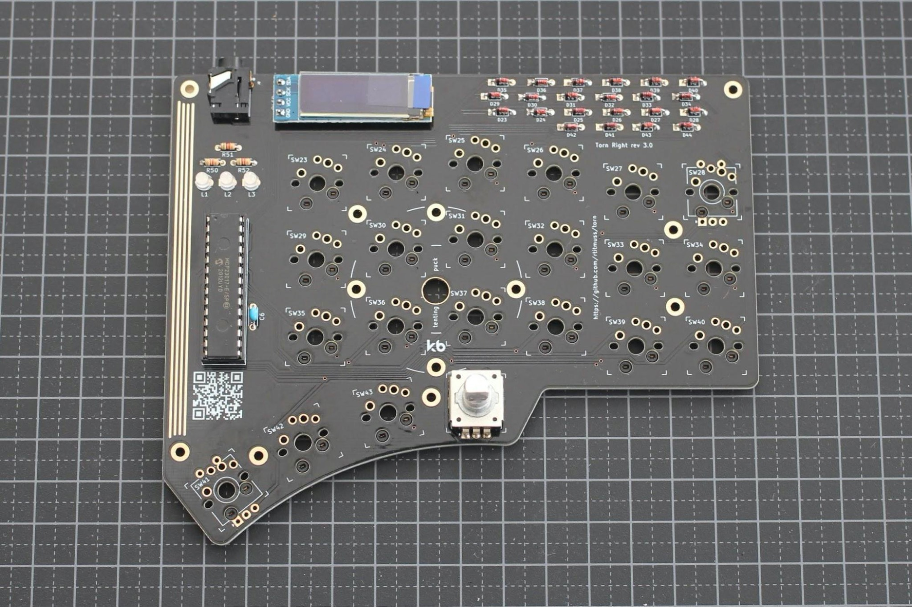

Apply a small piece of electrical tape to the encoder, this will prevent the encoder legs shorting on the pcb plate.

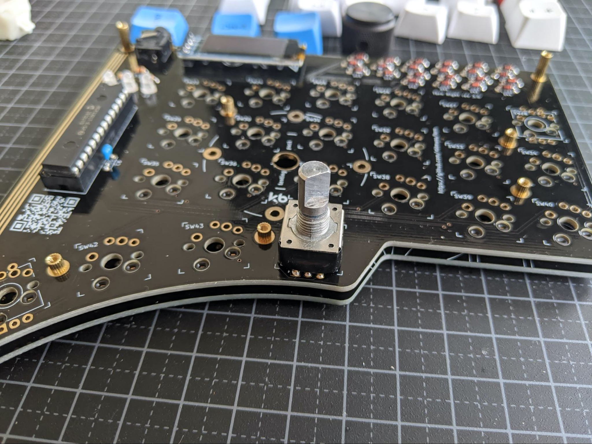


**Step 3**

The metal plating on some of the holes in the pcb plate is not perfect, so check the fit of the switches before the next step. I have found that occasionally Gazzew Boba U4 switches would stick in some of the thumb positions, and this might happen with other types of switches too. If you find a switch is sticking, use a small metal file to smooth the inside edges of the plate.


**Step 4**

Attach the 3+3mm standoffs with 3mm screws in the mounting holes of the pcb plate, and then put the plate on the main pcb.

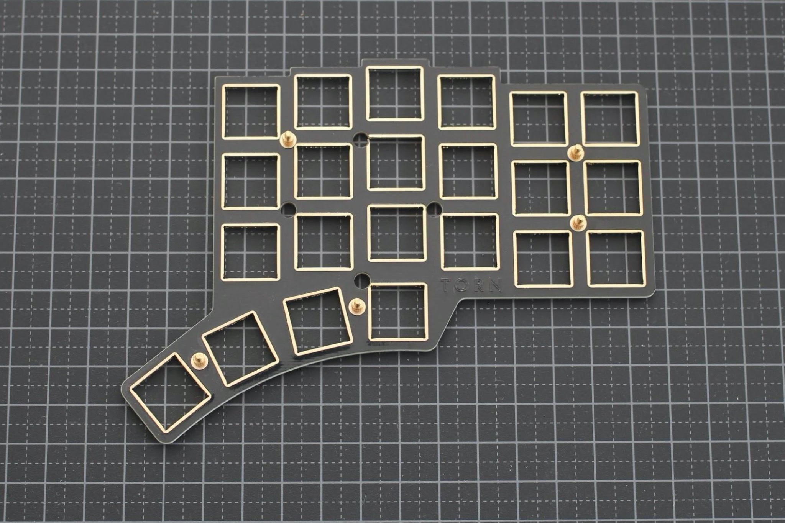

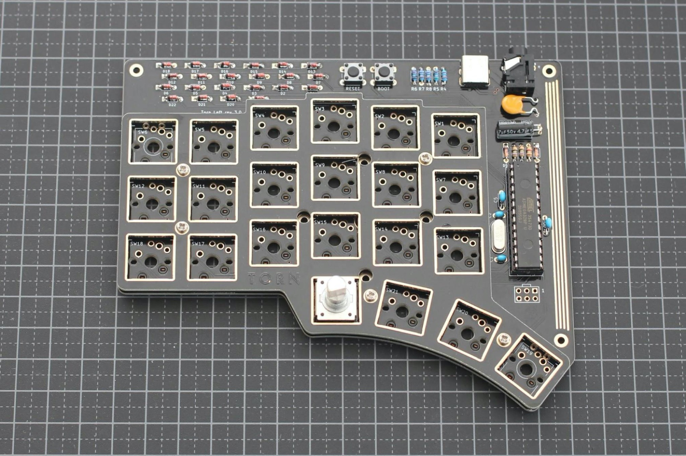


**Step 5**

Insert the switches through the pcb plate into the Kailh sockets. Keep the main pcb on a flat surface while installing the switches so that the sockets are supported.

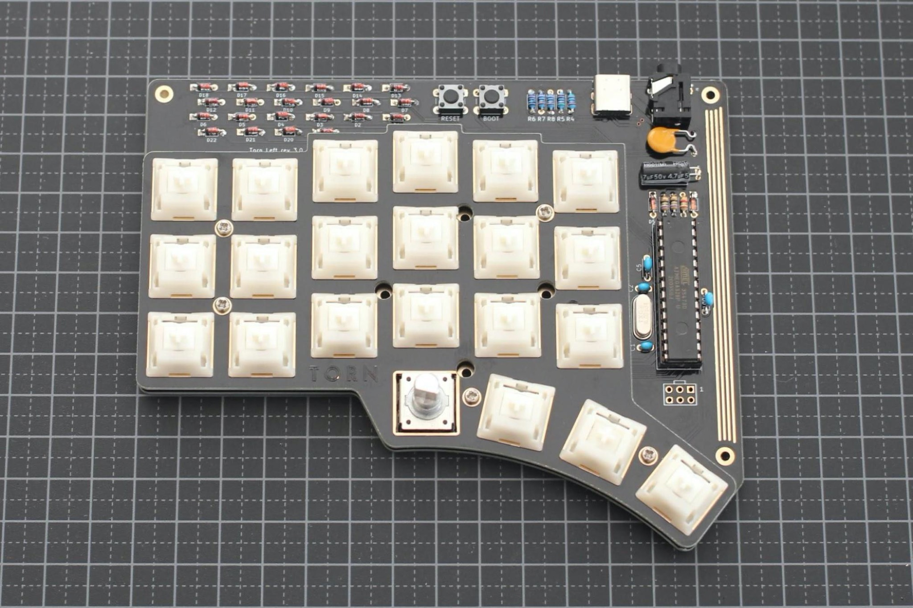


**Step 6**

Secure the plate using 3mm standoffs.

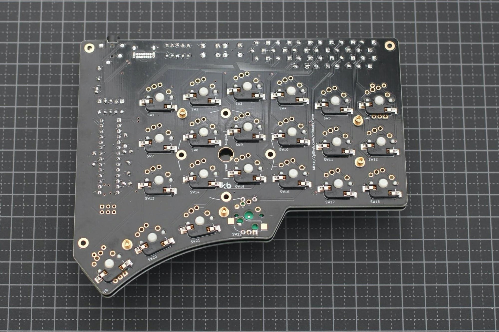


**Step 7**

Attach the 8mm and 3+3mm standoffs for the acrylic cover.

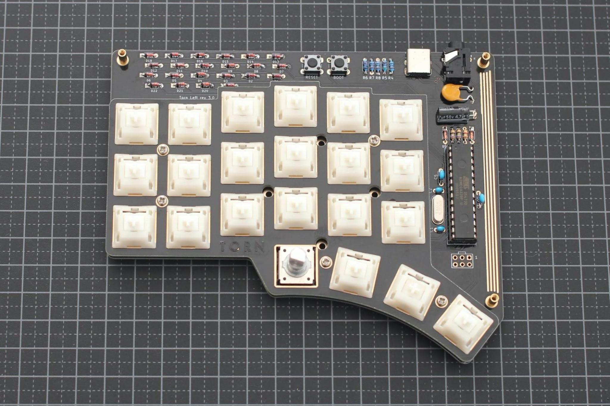


**Step 8**

Use 3mm screws to attach the base. Attach the feet where shown.

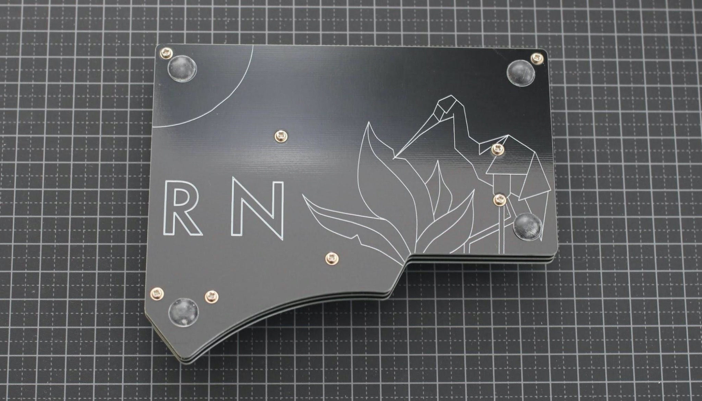


**Step 9**

Attach the acrylic covers using 5mm screws.


**Step 10**

Finally add the keycaps and knobs. You're finished!

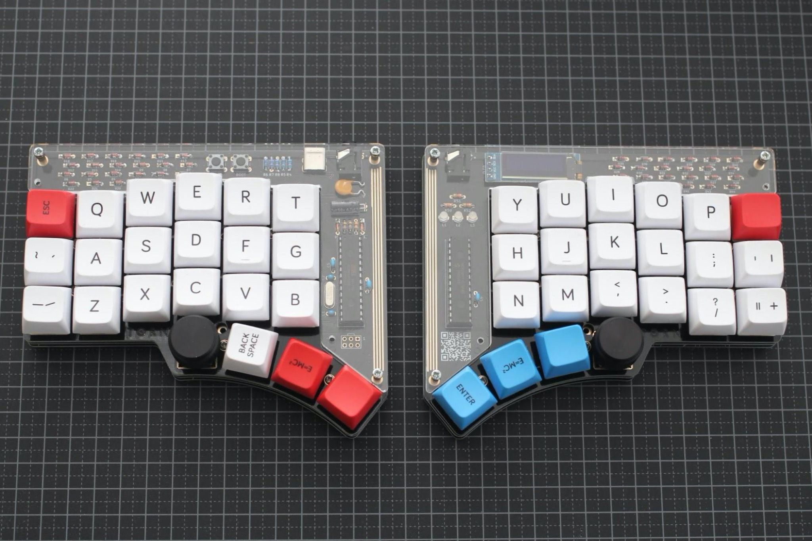


### Kailh Choc Switches

The following instructions are for Choc switches. You need to do all steps on both the left and right boards. You can also use the optional EC11 encoders and OLED display with Choc switches, but I choose to leave them both off for this build.

When using Choc switches it looks better if you lower the acrylic cover, to do this don’t use the IC sockets (steps 13 and 22 in the main instructions) and solder the ATMega328P and MCP23017 directly to the PCB.


**Step 1**

Place the pcb plate on the main pcb, and insert a few Choc switches. Make sure everything fits correctly. Then add the remaining switches.

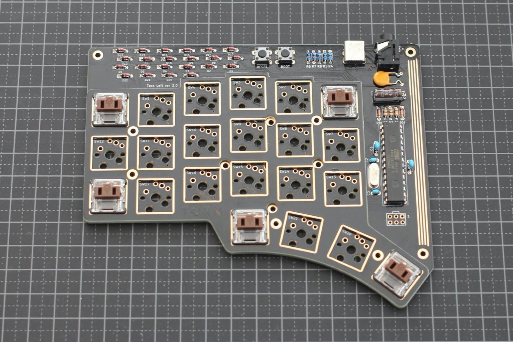


**Step 2**

Check that the switches are all inserted correctly, then solder the switches.

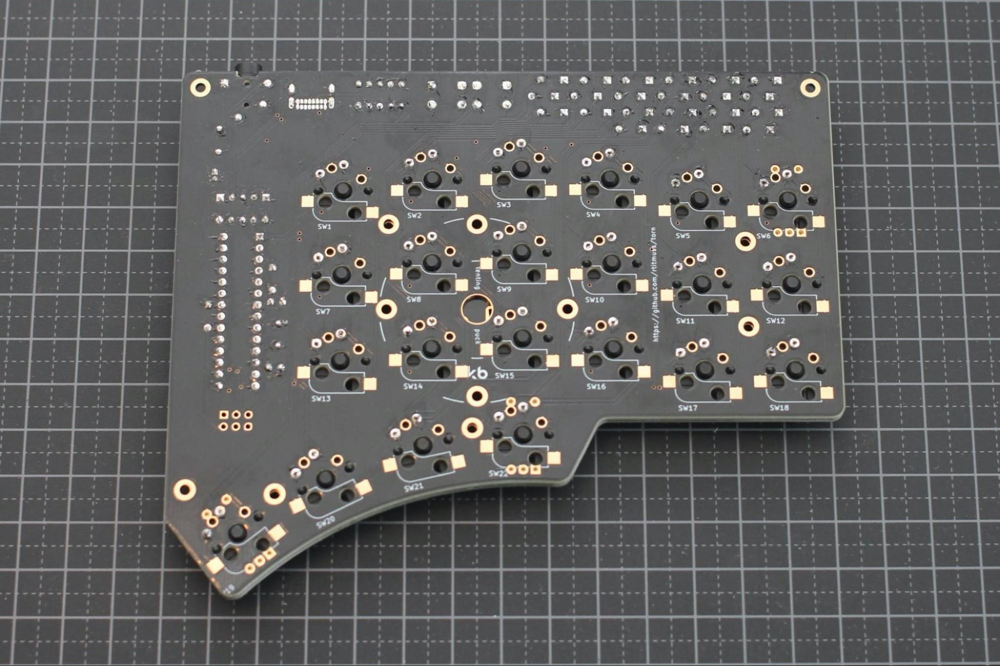


**Step 3**

Attach the 5mm standoffs or the acrylic cover using 3mm screws. If you used IC sockets, use 8mm standoffs.

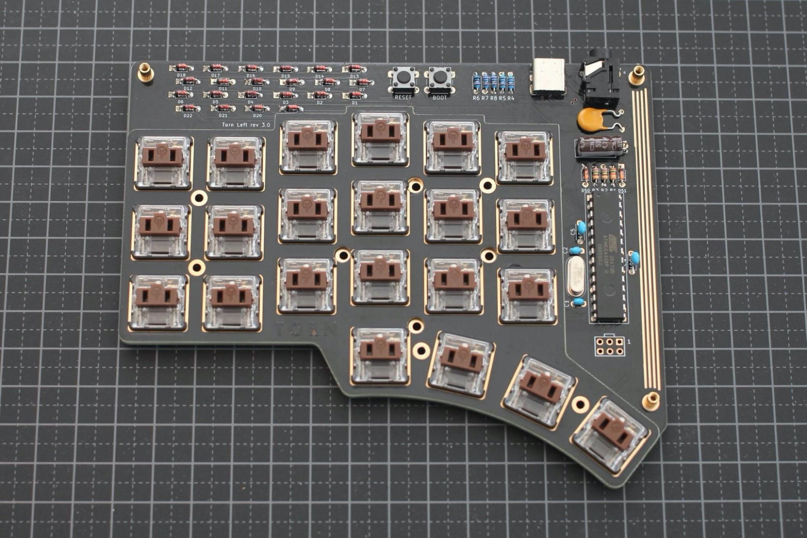


**Step 4**

Attach the acrylic covers using 5mm screws, and fit the keycaps.

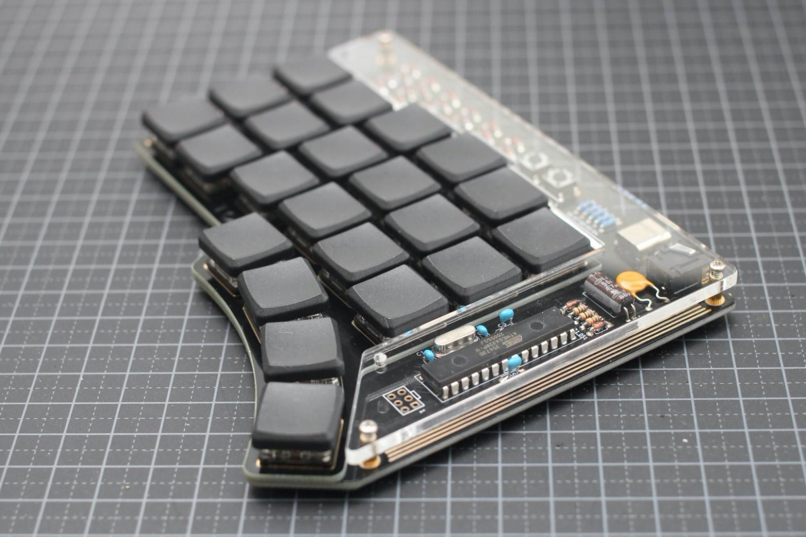


## Configuring Torn Keyboard

You can use VIA to configure the Torn Keyboard. Download and install Via from [https://caniusevia.com/](https://caniusevia.com/). VIA will allow you to dynamically remap the keys when you plug the keyboard in.

To erase the configuration and return to the default settings, press the top left button on the keyboard when plugging in the USB C connector.

If you want to change the rotary encoder settings, or customize the OLED display you must download the QMK firmware and follow the instructions for Programming QMK.


## Programming Torn Keyboard

If you bought the Torn Keyboard kit the ATmega328P has already been programmed, and you can skip to the Configuring Torn Keyboard section below. Otherwise if you purchased your own components you need to follow this section of the guide.


### Programming the bootloader {#programming-the-bootloader}

This guide uses an Arduino Uno to program the keyboard. You can use other ISP programmers that are supported by avrdude.


#### Arduino as ISP

First you need to program the Arduino Uno as an ISP, as described in Load the Sketch at [https://www.arduino.cc/en/Tutorial/ArduinoISP#toc5](https://www.arduino.cc/en/Tutorial/ArduinoISP#toc5). 


#### Wiring the programmer

You can use an Arduino Uno to program the AMegta328P with the ISP header on the right PCB. You need to connect the following pins:


Arduino Uno | Torn Keyboard
----------- | -------------
ICSP Pin 1 - MISO | ICP Pin 1 - COL4
ICSP Pin 2 - +Vcc | ICP Pin 2 - +5V
ICSP Pin 3 - SCK | ICP Pin 3 - COL3
ICSP Pin 4 - MOSI | ICP Pin 4 - COL5
ICSP Pin 5 - Reset | -
ICSP Pin 6 - Gnd | ICP Pin 6 - GND
Digital Pin 10 | ICP Pin 5 - Reset

The Arduino Uno board needs a 10µF electrolytic capacitor connected to RESET and GND with the positive (long leg) connected to RESET. The capacitor has to be placed after the programmer board has been loaded with the ISP sketch.


#### Flash the bootloader

Download the USBaspLoader source code from [https://github.com/rtitmuss/USBaspLoader/tree/torn](https://github.com/rtitmuss/USBaspLoader/tree/torn).

You can then flash the bootloader using:

```
    make
    make flash
    make fuse
```

One the bootloader has been flashed to the board, disconnect the Arduino Uno.

### Programming QMK

When the bootloader has been programmed to the Torn Keyboard you need to program QMK.

Download the QMK source code from [https://github.com/qmk/qmk_firmware](https://github.com/qmk/qmk_firmware).

Enter bootloader mode by:

1. Plug in the TRRS cable to connect the left and right sides for the keyboard
2. Plug in USB C cable between the keyboard and your PC
3. Push and hold RESET SW
4. Push and hold BOOT SW
5. Release RESET SW
6. Release BOOT SW

You can then program QMK using:

```
make torn:via:flash
```

For additional help flashing QMK please see [https://docs.qmk.fm/#/newbs_flashing](https://docs.qmk.fm/#/newbs_flashing).
