# Torn PCB Assembly

These are the instructions to build the Torn PCB.

## Tools

You will need the following tools to complete the Torn Keyboard:

*   Soldering iron and solder wire (leaded solder recommended)
*   Flush side cutters
*   No-clean flux paste (recommended to prevent bridging on USB pins)
*   Desoldering wick and Solder sucker (recommended to fix any mistakes)

## What’s included

The following components are included in the Torn Keyboard kit:

Ref | Component | Notes
--- | --------- | -----
C1, C2 | ***2 x 22pF Capacitor***
C3 | ***1 x 4.7uF Capacitor***
C4, C5, C6 | ***3 x 0.1uF Capacitor***
D1-44 | ***44 x 1n4148 Diode***
D50, D51 | ***2 x 3.6V Zener Diode*** | Keep separate from the 1n4148 diodes!
F1 | ***1 x 500ms Resettable fuse*** |
ISP1 | **1 x 6 pin header***
J1, J2 | ***2 x TRRS socket***
L1, L2, L3 | ***3 x LED***
OLED1 | ***1 x OLED display***
R1 | ***1 x 1.5k Tan Resistor*** | ***Brown - Green - Red***
R2, R3 | ***2 x 75 Tan Resistor*** | ***Purple - Green - Black***
R6 | ***1 x  10k Blue Resistor*** | ***Brown - Black - Orange***
R4, R5 | ***2 x 5.1k Blue Resistor*** | ***Green - Brown - Red***
R7, R8 | ***2 x 2.2k Blue Resistor*** | ***Red - Red - Red***
R50-52 | ***3 x 5.1K Tan Resistor*** | ***Green - Brown - Red***
. | ***2 x 28 pin IC socket***
BOOT, RESET | ***2 x 6mm Push button***
U1 | ***1 x ATmega328P***
U2 | ***1 x I/O Expander***
USB1 | ***1 x USB4085 SB C port***
Y1 | ***1 x 16MHz Crystal***
. | ***10 x m2 3mm spacer***
. | ***6 x m2 8mm spacer***
. | ***16 x m2 3mm+3mm spacer***
. | ***6 x m2 5mm screw***
. | ***26 x m2 3mm screw***
. | ***8 x Feet***

## Build Guide

Let’s start building, all the parts ready:

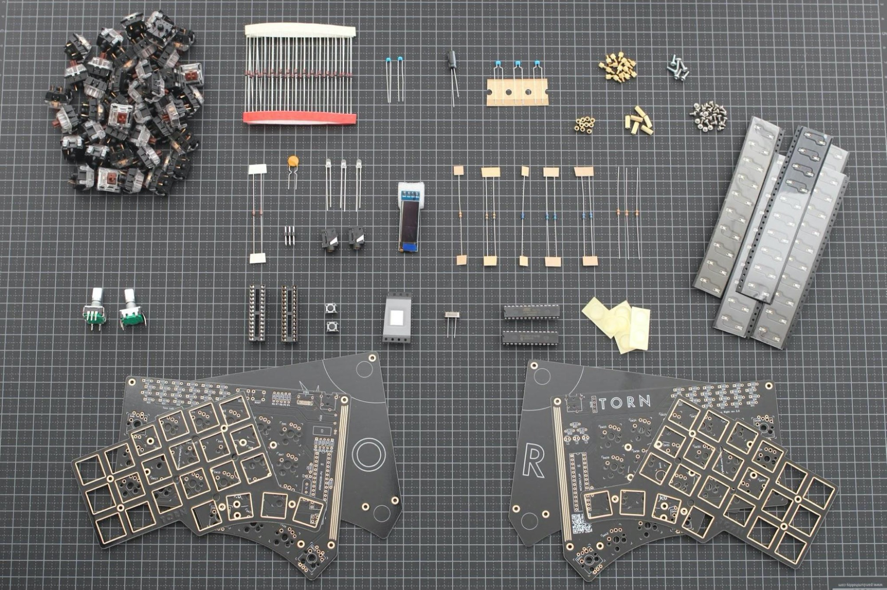

While building the keyboard you can use the interactive BOM for the [left](https://htmlpreview.github.io/?https://github.com/rtitmuss/torn/blob/master/doc/release/torn_left-ibom.html)
and [right](https://htmlpreview.github.io/?https://github.com/rtitmuss/torn/blob/master/doc/release/torn_right-ibom.html)
PCBs to help find the right place for each component. It can also be useful to refer to the 
[left](./release/torn_left-schematic.pdf) and [right](./release/torn_right-schematic.pdf) schematics
if you need to understand the traces (wires) between the components.

### Left side

**Step 1**

**22 x 1n4148 Diodes (D1 - D22)**

THIS PART HAS A SPECIFIC ORIENTATION - the **black bar on the diode will point LEFT** and will line up with the square pad.

Bend the legs straight down as close to the diode as possible, insert, solder and clip the legs.

**Step 2**

**2 x 5.1k Blue resistors (R4, R5)**

Bend the legs straight down as close to the resistor as possible, insert, solder and clip the legs.

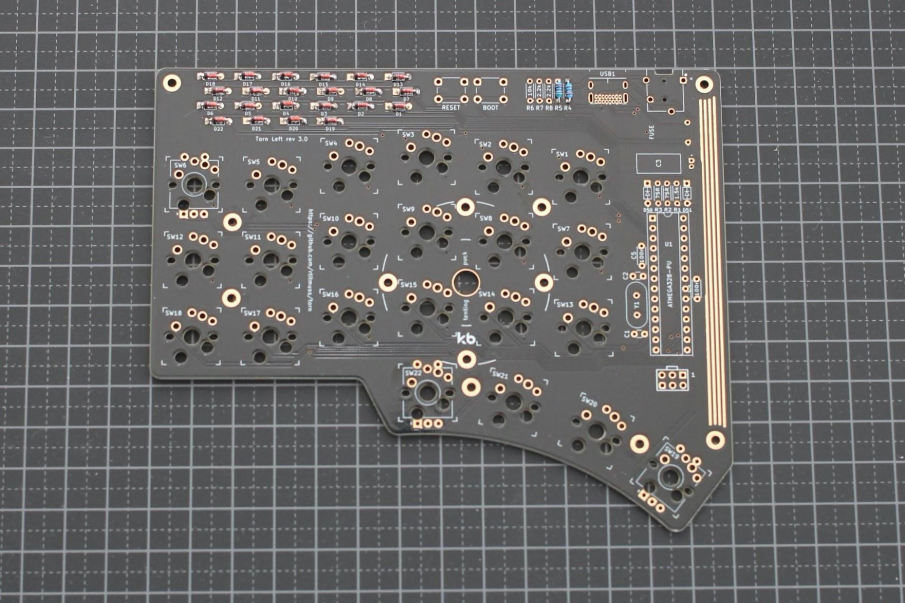

**Step 3**

**2 x 2.2k Blue resistors (R7, R8)**

Bend the legs straight down as close to the resistor as possible, insert, solder and clip the legs.

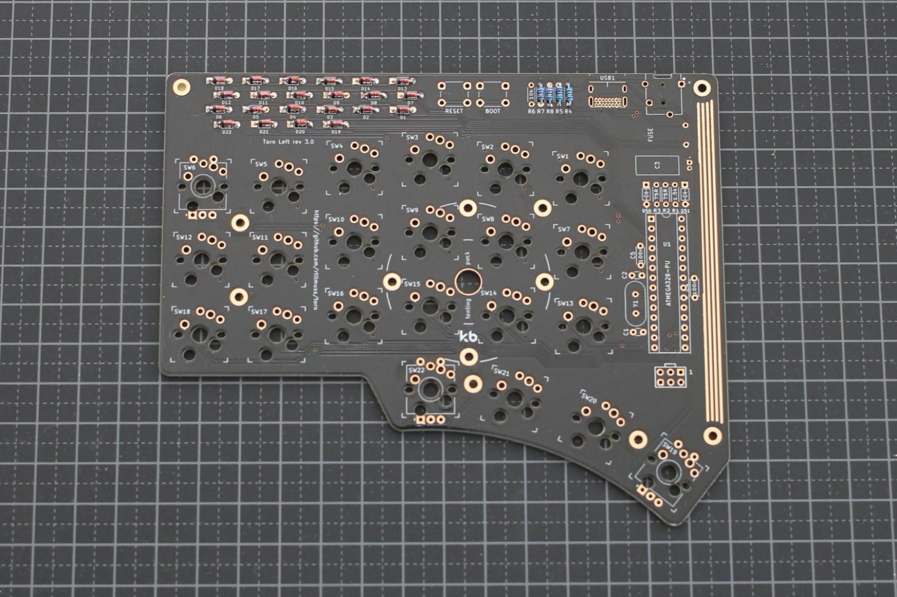

**Step 4**

**1 x 10k Blue resistor (R6)**

Bend the legs straight down as close to the resistor as possible, insert, solder and clip the legs.

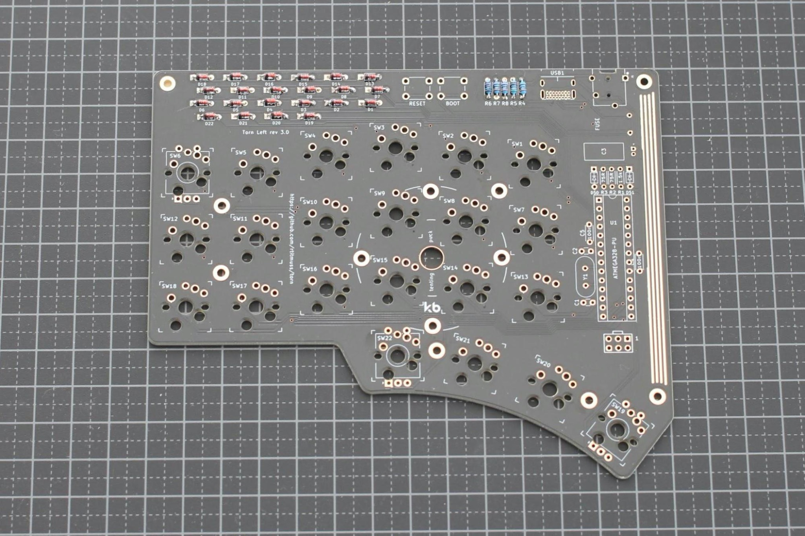

**Step 5**

**2 x 75 Tan resistor (R2, R3)**

Bend the legs straight down as close to the resistor as possible, insert, solder and clip the legs.

**Step 6**

**1 x 1.5k Tan resistor (R1)**

Bend the legs straight down as close to the resistor as possible, insert, solder and clip the legs.

**Step 7**

**2 x 3.6V Zener Diode (D50, D51)**

THIS PART HAS A SPECIFIC ORIENTATION - the **black bar on the diode will point UP** and will line up with the square pad.

Bend the legs straight down as close to the diode as possible, insert, solder and clip the legs.

**Step 8**

**1 x 16MHz Crystal (Y1)**

Insert the crystal, solder and clip the legs.

**Step 9**

**2 x 22pF Capacitor (C1, C2)**

These capacitors are the smaller blue capacitors with straight legs.

Insert the capacitors, solder and clip the legs.

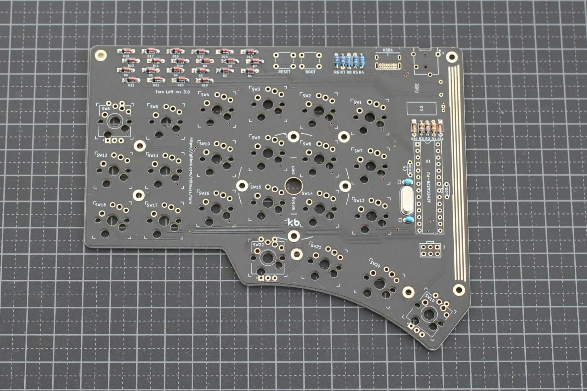

**Step 10**

**2 x 0.1uF Capacitor (C4, C5)**

These capacitors are the larger blue capacitors with wider legs.

Insert the capacitors, solder and clip the legs.

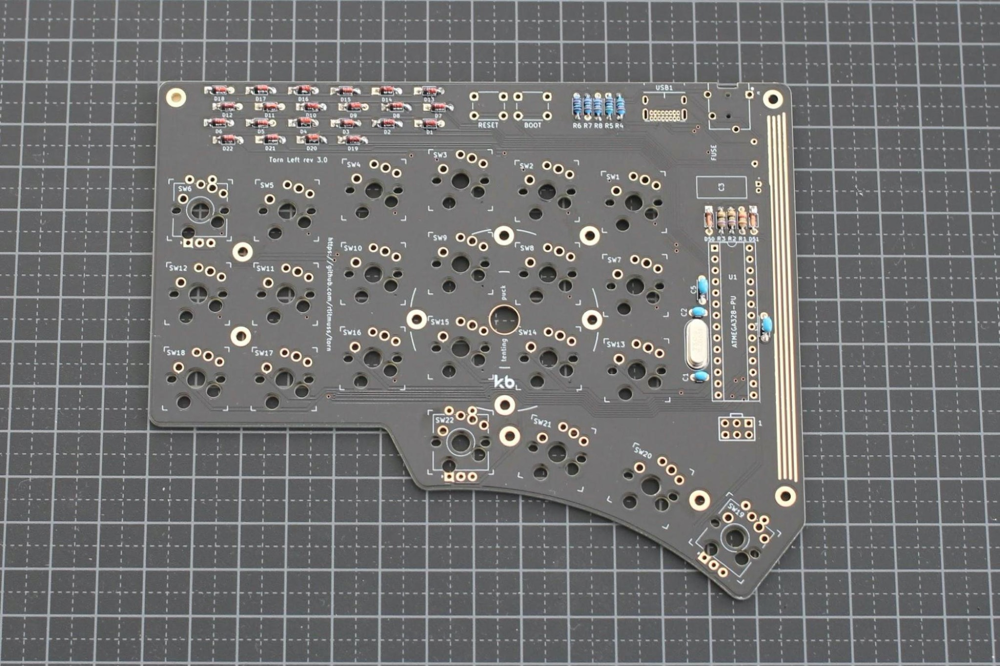

**Step 11**

**1 x USB4085 USB C port (USB1)**

Insert and tape the USB C port to the board. Flip board over. Solder only one of the large bottom legs. Check the port is flush before soldering the other three legs.  Remove the tape.

For the small pins you are going to use a different technique than the rest of the components. Apply no-clean flux paste across all pins. This step is possible without flux, but using it is highly recommended and will make the process much easier. Proceeding without flux for this step is not recommended. Apply a small amount of solder and drag your iron across the pins. Repeat until all holes are filled.

---
**NOTE**

When solering USB C port pins you might get bridges in two places (see image below), this is fine because all those pins are connected to ground.

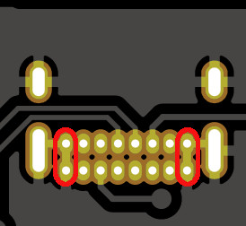
---

**Step 12**

**1 x TRRS socket (J2)**

Tape the TRRS socket to the board. Flip the board over. Solder only one pin, and check to ensure it is flush before continuing. After checking solder the remaining pins. Remove the tape.

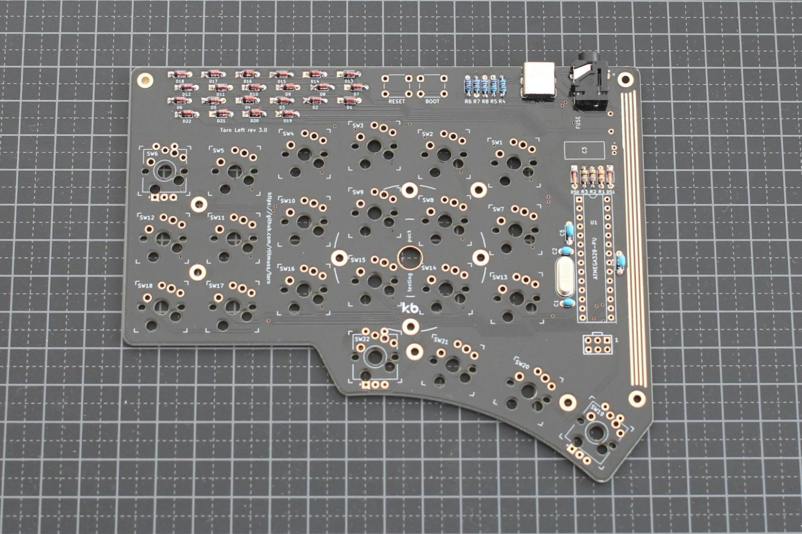

**Step 13**

**1 x 28 pin IC socket**

THIS PART HAS A SPECIFIC ORIENTATION - the **notch** on the IC sockets must be pointing **UP**.

Tape the IC socket to the board. Solder two opposite corners of the IC socket. Check the socket is flush before continuing. Solder the rest of the pins. Remove the tape.

**Step 14**

**2 x 6mm Push button (BOOT, RESET)**

Insert and solder BOOT and RESET switches.

**Step 15**

**1 x 4.7uF Capacitor (C3)**

THIS PART HAS A SPECIFIC ORIENTATION - the **longer leg** goes to the **square pad**, which is **UP**.

Insert the capacitor and solder. Fold down the capacitor as pictured after soldering. Clip the legs.

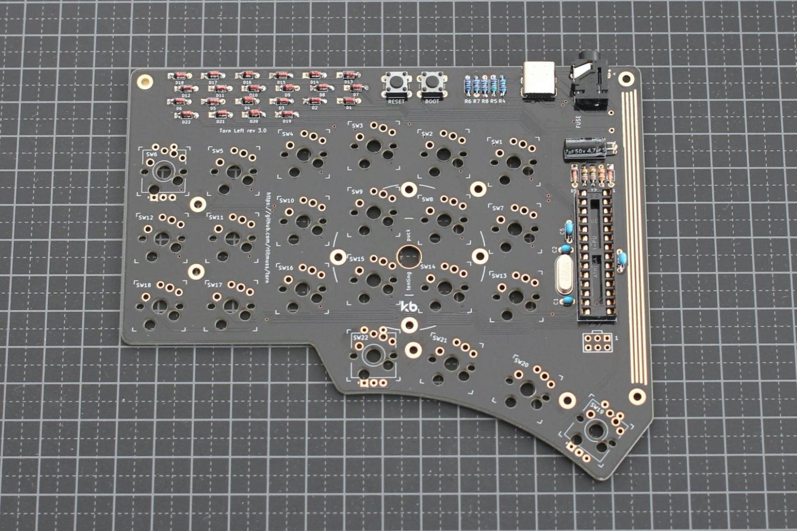

**Step 16**

**1 x 500ms Resettable fuse (F1)**

Insert the fuse, and solder. Fold down the fuse as pictured after soldering. Clip the legs.

**Step 17**

**1 x ATmega328P (U1)**

THIS PART HAS A SPECIFIC ORIENTATION - The **notch** on the ATmega328P must be pointing **UP**.

CHECK YOU HAVE THE RIGHT PART - it looks similar to U2, check the writing says **ATMEGA328P**.

Insert the ATmega328P. You may have to GENTLY bend the pins slightly inward for proper alignment with the socket.

### Right side

**Step 18**

**22 x 1n4148 Diodes (D23 - D44)**

THIS PART HAS A SPECIFIC ORIENTATION - the **black bar on the diode will point LEFT** and will line up with the square pad.

Bend the legs straight down as close to the diode as possible, insert, solder and clip the legs.

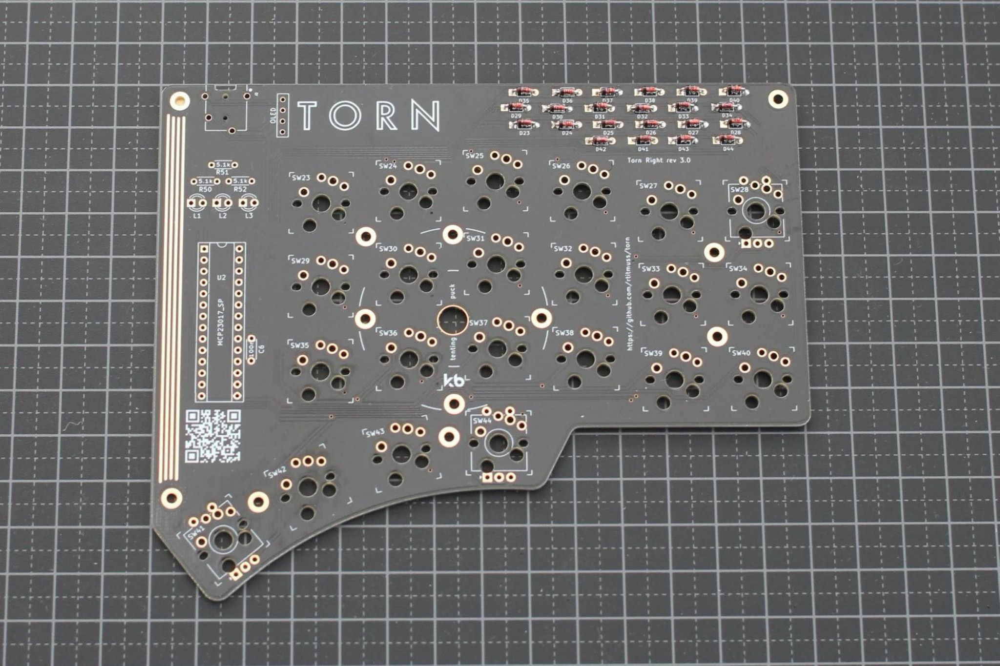

**Step 19**

**3 x 5.1k Tan resistor  (R50-52)**

Bend the legs straight down as close to the resistor as possible, insert, solder and clip the legs.

**Step 20**

**1 x 0.1uF Capacitor (C6)**

These capacitors are the larger blue capacitors with wider legs.

Insert the capacitors, solder and clip the legs.

**Step 21**

**1 x TRRS socket (J3)**

Tape the TRRS socket to the board. Flip the board over. Solder only one pin, and check to ensure it is flush before continuing. After checking solder the remaining pins. Remove the tape.

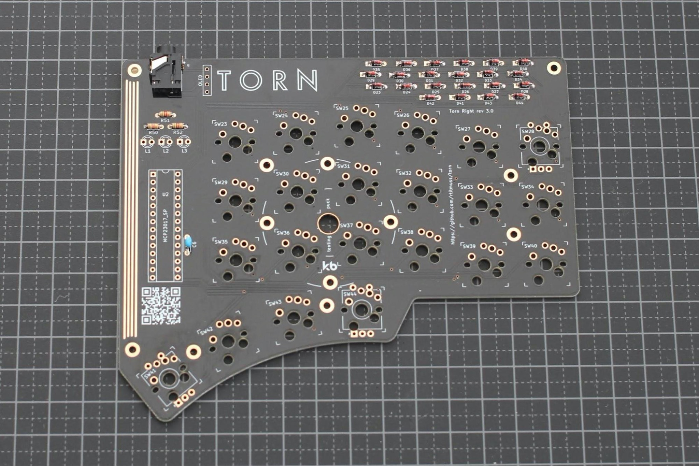

**Step 22**

**1 x 28 pin IC socket**

THIS PART HAS A SPECIFIC ORIENTATION - the **notch** on the IC sockets must be pointing **UP**.

Tape the IC socket to the board. Solder two opposite corners of the IC socket. Check the socket is flush before continuing. Solder the rest of the pins. Remove the tape.

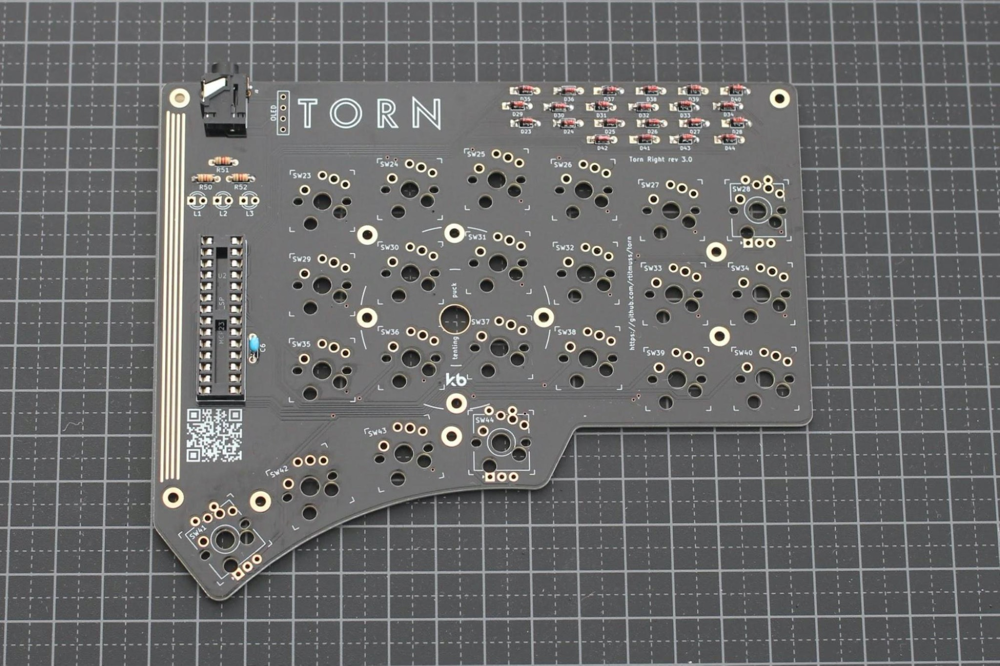

**Step 23**

**3 x LED (L1, L2, L3)**

THIS PART HAS A SPECIFIC ORIENTATION - the **shorter leg** goes to the **square pad**, which is **LEFT**.

Insert the LEDs, solder and clip the legs.

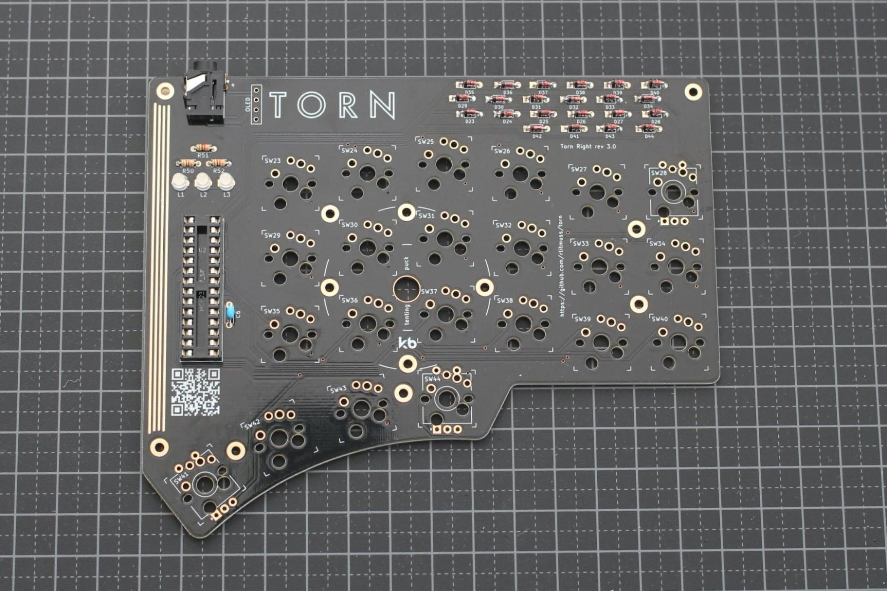

**Step 24 (Optional)**

**1 x OLED display**

You can optionally add an OLED display.

THIS PART HAS A SPECIFIC ORIENTATION - the **pins** go on the **LEFT**.

Insert the Oled, solder and clip the legs.

**Step 25**

**1 x I/O Expander (U2)**

THIS PART HAS A SPECIFIC ORIENTATION - The **notch** on the MCP23017 must be pointing **UP**

CHECK YOU HAVE THE RIGHT PART - it looks similar to U2, check the writing says **MCP23017**.

Insert the I/O Expander. You may have to GENTLY bend the pins slightly inward for proper alignment with the socket.

### Let’s test

To test the keyboard connect the TRRS cable between the left and right sides, and then connect the USB C cable.
the cable must be a **TRRS cable** with **4 contacts** and NOT a TRS cable with 3 contacts.
You should always disconnect the USB C cable before inserting or removing the TRRS cable. 

The firmware is preinstalled if you’ve bought a kit, otherwise before continuing see the instructions to [flash the bootloader](bootloader.md) and [qmk](build.md#qmk).

It is a good idea to now test the board before adding the key switches. This is easiest with Via, so first download and install it from [https://caniusevia.com/](https://caniusevia.com/). Your new Torn keyboard should be automatically detected when you connect it to your PC.

Select the Key Tester tab, and enable Test Matrix. You can now test each key switch by shorting the contacts with tweezers or some wire. Make sure all switches work before continuing.

You can check the [troubleshooting guide](troubleshoot.md) if the keyboard is not working.

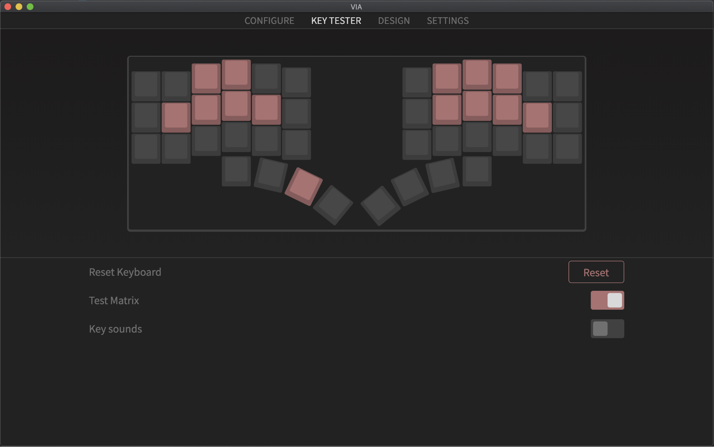

### Cases and Keyswitches

Congratulations the PCB assembly is complete. There are several different options for keyboard cases
and keyswiches. [Continue here](./build.md#torn-keyboard-cases) 
